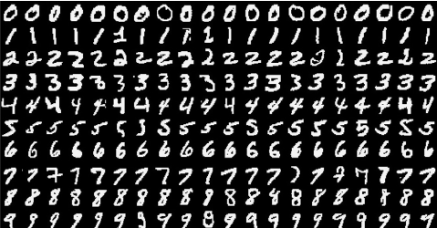

### Getting Started

이 튜토리얼은 [Theano - Getting Started](http://www.deeplearning.net/tutorial/gettingstarted.html)페이지를 가지고 작업하였습니다.

### Download

이 튜토리얼에서는 딸림파일을 다운로드 받아야 할 것입니다, 파일을 한번에 다운받고 싶다면 커맨드 라인 창에 다음의 명령어를 입력하시길 바랍니다.

```bash
git clone https://github.com/lisa-lab/DeepLearningTutorials.git
```

당신의 운영체제가 리눅스 혹은 맥 운영체제라면, 모든 데이터셋을 한방에 다운로드 받는 쉘 스크립트를 다음과 같이 실행시키면 됩니다.

```bash
cd DeepLearningTutorials/data ./downloads.sh
```

### Datasets

### MNIST Dataset
([mnist.pkl.gz](http://deeplearning.net/data/mnist/mnist.pkl.gz))
MNIST 데이터셋은 (28, 28) 사이즈의 데이터셋으로 나누어진 손글씨 파일입니다, 색깔은 검은색 바탕 안에 하얀색 0~9 사이의 숫자로 이루어진 데이터셋 입니다.


```python
from IPython.display import Image
from IPython.core.display import HTML 
print("이미지 출처: https://www.researchgate.net/figure/264900175_fig6_Fig-6-Examples-of-the-MNIST-dataset")
Image(url= "Fig-6-Examples-of-the-MNIST-dataset.png")
```

    이미지 출처: https://www.researchgate.net/figure/264900175_fig6_Fig-6-Examples-of-the-MNIST-dataset





이 데이터셋과 뉴럴 네트워크를 사용하여 학습을 시킬 것입니다. 학습 방법은 다음과 같습니다.

1. 우선 `mnist.pkl.gz`에 들어가 있는 파일은 28X28 Array 로 이루어진 파일입니다.

    - 이를 28 × 28 = 784가 됩니다. 이를 쫙 가로로 한줄로 펼칩니다.

    - 그러면 그것들은 input값이 됩니다. 입력되는 값이죠.

    - 이미지를 Array 상으로 펼칠때, 0(검은색)에서 255(하얀색)의 사이값으로 반환합니다.

2. 그럼 이것들을 가지고 학습을 합니다. 방법은 뉴럴 네트워크가 동작하는 방법과 같습니다. 

    - 뉴럴 네트워크는 동작하는 방법이 Weight 값과 Bias값에 의하여 조정되고 실행됩니다.

    - $f(w\times x)+b$

    - bias 값은 조정하는 역할을 합니다, 보통 이런 곳에는 Sigmoid 함수를 사용하는데, 이 시그모이드 함수는 S자로 생겼다 하여 Sigmoid 함수입니다. 

        - 활성화 함수인데, 활성하 함수에는 Sigmoid, Relu 함수가 대중적으로 사용됩니다.

    - 그래서 이것들을 연결하고 연결해서 학습을 진행하면 결과값이 있을 것입니다.

        - 이것들은 아까 말했던 0~9사이의 수입니다, 이들을 라벨(Label)이라고 합니다.

    - 그럼 그 결과값에 계속 최적화를 해서, 수 많은 뉴런들을 맞춥니다.

        - 이 구간에서 SGD(경사 하강법)가 하는 일이 그것잆니다, 적절한 값을 찾는 방법을 이 알고림이 해 줄 것입니다.

            - 확률적 경사 하강법은 코드에서 보실 테지만, minibatch 가 그 역할을 합니다.

                - 미니배치는 훈련 데이터에서 무작위로 뽑아옵니다.

                - 공이 볼 안에서 떨어지는데 굉장히 똑똑한 놈입니다, 공이 확률을 보고 떨어집니다. 

                - 일단 먼저 뉴런들이 계산을 해서 손실함수의 값을 산출하면, 공은 그 손실함수에 따라 어디고 갈지 결정합니다.

                - 이것을 계속 반복해서, 최소한 손실함수 값을 줄입니다.

                    - 이 과정에서 뉴런의 Weight 값과 Bias 값들이 바뀝니다.

3. 그럼 이것들이 잘 동작했으면 어느순간에 작업을 중지합니다.

    - 이것들이 어느순간까지 잘 동작했다면 작업을 중단합니다.

    - 과적합(Overfitting)의 원인이 됩니다.

이런 과정을 통하여 작업이 진행됩니다, 아래는 그것을 먼저 작업하기 위한 코드입니다.

우선 NVIDIA GPU가 달린 컴퓨터가 필요합니다, 그것이 오늘의 학습을 아주 빠르게 해 줄 것입니다.

그리고 여기에서는 데이터의 성질을 바꾸는 것을 권장한다고 합니다, int(정수)에서 float(실수)로 바꾸라고 합니다. 

왜냐면 GPU 메모리 Overhead가 발생할 수 있다고 하는 이유입니다. 

처음에는 변환하는 코드를 사용하여 변환하는 코드를 시작으로 전체 코드를 보여 드리고 실행한 결과를 보여 드리도록 하겠습니다.

코드는 [여기](https://github.com/Newmu/Theano-Tutorials/blob/master/3_net.py)를 참조하였습니다, 원래 코드는 너무 길어서 잘 만들어 놓은 코드를 참조하여 설명 드리도록 하겠습니다.


```python
import theano # Theano임포트
from theano import tensor as T # Tensor이라는 모듈을 T로 설정(타이핑을 적게 할 수 있다.)
import numpy as np # 넘파이를 임포트하여 np처럼 읽겠다.
from load import mnist # mnist손글씨 데이터 로드
from foxhound.utils.vis import grayscale_grid_vis, unit_scale 
from scipy.misc import imsave # Scipy 모듈 로드

def floatX(X):
  	# 이 함수는 int형을 float형으로 바꾸는 코드입니다. 
    return np.asarray(X, dtype=theano.config.floatX)
  	# 앞에서 말했던 int32에서 float로 바꾸는 코드입니다.
    # 넘파이 어레이로 floatX로 변환하여 리턴합니다.

def init_weights(shape):
  	# 가중치(Weight) 값을 초기화 하는 함수입니다.
    return theano.shared(floatX(np.random.randn(*shape) * 0.01))
  	# 넘파이의 랜덤값으로 지정합니다.

def sgd(cost, params, lr=0.05):
  	# 확률적 경사 하강법을 실행하는 함수입니다.
    # lr(learning rate)는 0.05 입니다.
    grads = T.grad(cost=cost, wrt=params)
    # grads라는 변수에 그라디언트 함수를 사용하여 그라디언트 작업을 동작합니다. 
    updates = []
    # updates라는 빈 행렬(Array) 변수를 생성합니다. 
    for p, g in zip(params, grads):
        updates.append([p, p - g * lr])
    return updates
  	# 업데이트 된 변수를 updates라는 함수에 집어넣고, 이 변수를 리턴합니다.

def model(X, w_h, w_o):
    h = T.nnet.sigmoid(T.dot(X, w_h))
    # 활성화 함수인 시그모이드 함수를 사용하여 인풋값과 가중치 값을 집어넣습니다.
    pyx = T.nnet.softmax(T.dot(h, w_o))
    # 그리고 softmax함수를 사용하여 0~9사이의 수가 확률적인 것을 표시해줍니다.
    return pyx
  	# 앞서 동작한 결과를 리턴합니다

trX, teX, trY, teY = mnist(onehot=True)
# 테스트 변수와 학습 변수를 각각 로드합니다, 원 핫 인코딩을 참으로 설정했습니다.
# 간단하게 설명하자면 각 변수대로, 모든 값을 Array 에 넣어서 각 변수에 지정합니다.

X = T.fmatrix()
Y = T.fmatrix()
# T.fmatrix float matrix 로 생성하는데, 두개의 변수가 포함되어 있도록 만듭니다. 
# 자세한 설명 링크: http://deeplearning.net/software/theano/library/tensor/basic.html

w_h = init_weights((784, 625))
w_o = init_weights((625, 10))
# 가중치값을 초기화합니다
# 계산합니다. f(wx+b)의 과정을 실행합니다. 그러나 여기서는 최적화를 하지 않습니다, 아래의 루프를 돌리는 곳에서 합니다.
py_x = model(X, w_h, w_o)
y_x = T.argmax(py_x, axis=1)
# 각 함수들을 지정합니다, 손실함수와 파라메터, 그리고 SGD(Stochastic Gradent Descent)알고리즘을 업데이트하는 함수까지.
cost = T.mean(T.nnet.categorical_crossentropy(py_x, Y))
params = [w_h, w_o]
updates = sgd(cost, params)
# 학습 데이터 변수와, 테스트 데이터 변수를 지정하고.
train = theano.function(inputs=[X, Y], outputs=cost, updates=updates, allow_input_downcast=True)
predict = theano.function(inputs=[X], outputs=y_x, allow_input_downcast=True)
# 루프를 100번씩 돌려서 학습합니다. 100번이라는 것이 minibatch 에 해당하겠습니다.
for i in range(100):
    for start, end in zip(range(0, len(trX), 128), range(128, len(trX), 128)):
        cost = train(trX[start:end], trY[start:end])
    print np.mean(np.argmax(teY, axis=1) == predict(teX))
```

**코드를 GPU에서 실행시켜 봐야 하는데 집에서는 GPU가 없습니다!** 

CPU에서 학습하면 시간이 오래 걸립니다! 필히 GPU를 사용하시기 바랍니다! 